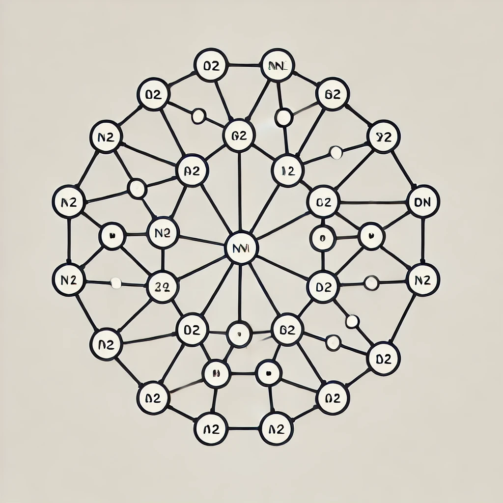
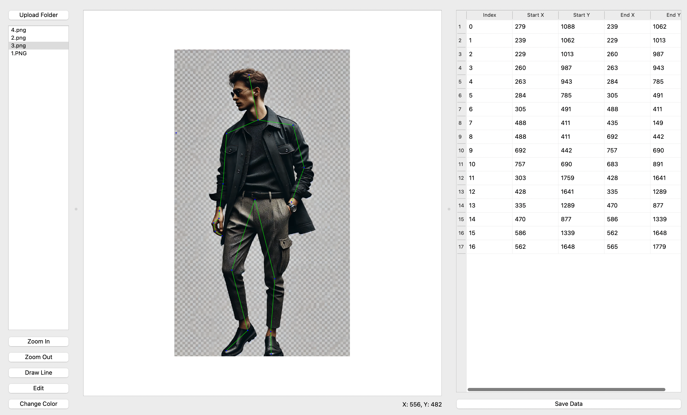
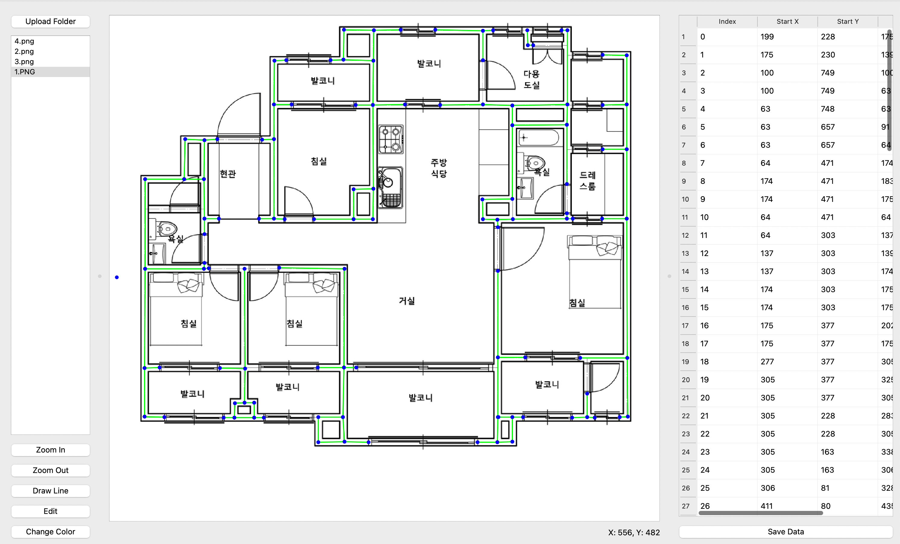

# Pose Detection Annotation Tool

A simple annotation tool built with PyQt5 for creating precise pose annotations in images. Designed for researchers and developers working on pose detection and graph neural network datasets, it offers an intuitive interface and an efficient workflow for annotating keypoints and connections.

<!--  -->
<p align="center">
  
</p>


<p align="center">
  <span style="display: inline-block; background: #4F4F4F; padding: 5px 10px; border-radius: 5px; color: white; font-weight: bold;">python3: </span>
  <span style="display: inline-block; background: #0077b5; padding: 5px 10px; border-radius: 5px; color: white; font-weight: bold;"> 3.10 <= </span>
  <span style="display: inline-block; background: #4F4F4F; padding: 5px 10px; border-radius: 5px; color: white; font-weight: bold;">| PyQt5</span>
</p>

<p align="center">
  <a href="#installation">[Installation](#Installation)</a> | <a href="#usage">[Usage](Usage)</a> | <a href="#examples">Examples</a>
</p>


<!-- <div align="center">
  <a href="https://pypi.python.org/pypi/labelme"></a>
  <a href="https://pypi.org/project/labelme"></a>
  <a href="https://github.com/wkentaro/labelme/actions"></a>
</div>

<div align="center">
  <a href="#installation"><b>Installation</b></a>
  | <a href="#usage"><b>Usage</b></a>
  | <a href="#examples"><b>Examples</b></a>
</div> -->

<br/>


---

## 🚀 Features


<p align="center">
  
  
  
</p>


- **Intuitive Interface**: Clean and user-friendly interface with three panels (file browser, annotation area, and data table)
- **Continuous Line Drawing**: Efficient pose annotation with continuous line mode
- **Smart Point Snapping**: Automatically snaps to nearby points for precise annotations
- **Real-time Coordinates**: Live display of cursor coordinates for accurate positioning
- **Dynamic Grid Lines**: Helper lines for precise alignment
- **Zoom and Pan**: Smooth zoom and pan controls for detailed annotations
- **Data Management**: 
  - Auto-save feature
  - CSV export format
  - Bulk image processing
- **Edit Capabilities**:
  - Move points
  - Delete lines/points
  - Add midpoints
  - Undo/Redo support
- **Visual Aids**:
  - Point highlighting
  - Line highlighting
  - Dark/Light mode toggle
  - Coordinate grid

---

## 📥 Installation

Create a virtual environment(recommended)

### Prerequisites
- Python 3.10 or higher
- PyQt5
### Install Required Packages
Run the following command:
```bash
pip install PyQt5
```

### Setup

1. **Clone the repository:**
   ```bash
   git clone https://github.com/Laudarisd/pose-detection-annotation-tool.git
   cd pose-detection-annotation-tool
   ```

2. **Install dependencies:**
   ```bash
   pip3 install -r requirements.txt
   ```

3. **Run the tool:**
   ```bash
   python3 annotation_tool.py
   ```

---

## 🛠️ Usage

### 🔹 Basic Workflow

1. **Load Images**
   - Click "Upload Folder" or use keyboard shortcut
   - Select a folder containing images
   - Images appear in the left panel

2. **Create Annotations**
   - Click "Draw Line" or press 'W' to enter drawing mode
   - Left-click to start annotation
   - Continue clicking to add connected points
   - Double-click or press Enter to end the current line
   - Points automatically snap when close to existing points

3. **Edit Annotations**
   - Click "Edit" or use a shortcut to enter edit mode
   - Drag points to adjust positions
   - Click on lines to add midpoints
   - Use the Delete key to remove selected points/lines

4. **Save Work**
   - Annotations auto-save when switching images
   - Click "Save Data" or press Ctrl+S to manually save
   - Data saves in CSV format inside the 'csv_data' folder

---

## ⌨️ Keyboard Shortcuts

| Shortcut | Action |
|----------|--------|
| **W** | Enable drawing mode |
| **A** | Previous image |
| **D** | Next image |
| **Ctrl+Z** | Undo |
| **Ctrl+S** | Save annotations |
| **Ctrl+F** | Fit image to screen |
| **Delete** | Remove selected point/line |
| **Enter / Double-click** | End continuous line |
| **Esc** | Cancel current operation |

---

## 🖱️ Mouse Controls

| Action | Result |
|--------|--------|
| **Left Click** | Place point/Select |
| **Double Click** | End line/Zoom in |
| **Mouse Wheel** | Zoom in/out |
| **Right Click** | Open context menu |
| **Drag (Edit Mode)** | Move points |
| **Drag (View Mode)** | Pan view |

---

## 📄 Output Format

The tool saves annotations in **CSV format** with the following structure:

```csv
Index,Start X,Start Y,End X,End Y,Image Width,Image Height
0,100,200,150,250,800,600
1,150,250,200,300,800,600
...
```

---

## 🤝 Contributing

1. **Fork the repository**
2. **Create your feature branch**
   ```bash
   git checkout -b feature/AmazingFeature
   ```
3. **Commit your changes**
   ```bash
   git commit -m "Add some AmazingFeature"
   ```
4. **Push to the branch**
   ```bash
   git push origin feature/AmazingFeature
   ```
5. **Open a Pull Request**

---

## ⚖️ License

This project is licensed under the **MIT License** - see the [LICENSE](LICENSE) file for details.

---

## 🙌 Acknowledgments

- Inspired by annotation tools like **LabelMe** and **LabelImg**
- Built with **PyQt5**
- Thanks to contributors & community feedback

---

## 📩 Contact

👤 **Your Name**  
📧 **your.email@example.com**  
🔗 **[GitHub Repository](https://github.com/Laudarisd)**  

---

## 📝 Changelog

### **Version 1.0.0 (2024-01-31)**
- Initial release
- Basic annotation functionality
- CSV export support
- Continuous line drawing
- Point editing capabilities


### Need to add
